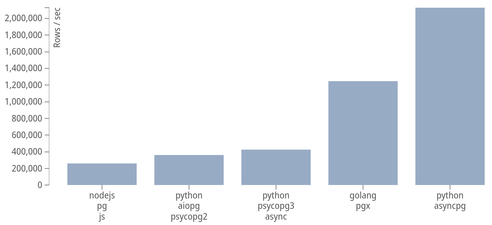

asyncpg -- A fast PostgreSQL Database Client Library for Python/asyncio
=======================================================================

.. image:: https://travis-ci.org/MagicStack/asyncpg.svg?branch=master
    :target: https://travis-ci.org/MagicStack/asyncpg

.. image:: https://ci.appveyor.com/api/projects/status/github/MagicStack/asyncpg?branch=master
    :target: https://ci.appveyor.com/project/elprans/asyncpg

.. image:: https://img.shields.io/pypi/v/asyncpg.svg
    :target: https://pypi.python.org/pypi/asyncpg

**asyncpg** is a database interface library designed specifically for
PostgreSQL and Python/asyncio.  asyncpg is an efficient, clean implementation
of PostgreSQL server binary protocol for use with Python's ``asyncio``
framework.  You can read more about asyncpg in an introductory blog post
`here <http://magic.io/blog/asyncpg-1m-rows-from-postgres-to-python/>`_.

Documentation
-------------

The project documentation can be found
`here <https://magicstack.github.io/asyncpg/current/>`_.

Performance
-----------

In our testing asyncpg is, on average, **3x** faster than psycopg2
(and its asyncio variant -- aiopg).

The above results are a geometric mean of benchmarks obtained with PostgreSQL
`client driver benchmarking toolbench <https://github.com/MagicStack/pgbench>`_.

Features
--------

asyncpg implements PostgreSQL server protocol natively and exposes its
features directly, as opposed to hiding them behind a generic facade
like DB-API.

This enables asyncpg to have easy-to-use support for:

* **prepared statements**
* **scrollable cursors**
* **partial iteration** on query results
* automatic encoding and decoding of composite types, arrays,
  and any combination of those
* straightforward support for custom data types

Installation
------------

asyncpg requires Python 3.5 and is available on PyPI.
Use pip to install it::

    $ pip install asyncpg

Basic Usage
-----------

.. code-block:: python

    import asyncio
    import asyncpg

    async def run():
        conn = await asyncpg.connect(user='user', password='password',
                                     database='database', host='127.0.0.1')
        values = await conn.fetch('''SELECT * FROM mytable''')
        await conn.close()

    loop = asyncio.get_event_loop()
    loop.run_until_complete(run())

License
-------

asyncpg is developed and distributed under the Apache 2.0 license.
